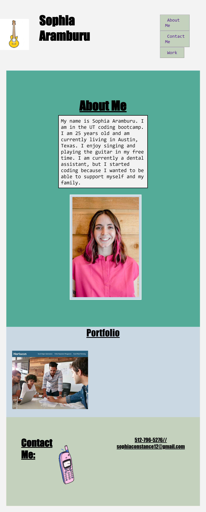

git # Second Homework

## Sophia Aramburu

**Goal:**

My goal for this project was to create a personal portfolio for myself while putting to work the knowledge I have gained the past couple of weeks. This project has helped me create a portfolio that I can continue adding to, while at the same time, helped me practice the skills I have learned so far. It also showed me what skills I need to work on. I really enjoyed playing around with the hover elements at the end once I made the CSS and the html page the way I wanted it. My future goal is to continue adding on to it with the skills I continue to learn in class.

**Building A Responsive Website**

- I was assigned to create a responsive website from scratch. That included making the HTML and CSS from start to finish. The first step I took was to create a strong HTML. Second, I made sure to use proper use of semantic html. I then added functional links to my navigation bar that takes the website visitor to the corresponding section of the page. My fourth step was adding a GIF to the top and bottom of my webpage. I inserted a GIF of a guitar that changes into different guitars on the bottom. It represents my love for music, while at the same time, showing the viewer a little bit more about myself since I play the guitar. On the bottom, I added a picture of a cellphone inside of my contact section to give it more character. Lastly, I added comments CSS more comprehensive and added alt tags to my images for accesibility. 

- I used CSS to start styling my website once I finished making the HTML. I found out this is where my strong suit is. I still have a lot to learn but I feel like playing around with all of the designs really increased my knowledge and practice for using CSS. I used CSS to make my website have character and become easier to look at. I changed the background-colors within certain elements. I also changed the font-families, font-sizes, and changed certain elements to change color and size when hovering over it; these are also known as hover effects. I also added border shadows, border-styles, and text decorations. 

-I made sure the website was responsive so that it will look good on all screen sizes on many types of devices. I KIND OF made sure to go by the Boy Scout rule.. "to make sure you leave code cleaner than you found it." Except for the fact that I didn't find it, I made it myself. But I made sure the finished product was clean and easy to read. 
## Demo

View the website at the link below:

​
## Credits
​
All images were created and edited by Google and Sophia Aramburu
​
## License
​
MIT License
​
Copyright (c) 2022 Sophia Aramburu 
Permission is hereby granted, free of charge, to any person obtaining a copy
of this software and associated documentation files (the "Software"), to deal
in the Software without restriction, including without limitation the rights
to use, copy, modify, merge, publish, distribute, sublicense, and/or sell
copies of the Software, and to permit persons to whom the Software is
furnished to do so, subject to the following conditions:
​
The above copyright notice and this permission notice shall be included in all
copies or substantial portions of the Software.
​
THE SOFTWARE IS PROVIDED "AS IS", WITHOUT WARRANTY OF ANY KIND, EXPRESS OR
IMPLIED, INCLUDING BUT NOT LIMITED TO THE WARRANTIES OF MERCHANTABILITY,
FITNESS FOR A PARTICULAR PURPOSE AND NONINFRINGEMENT. IN NO EVENT SHALL THE
AUTHORS OR COPYRIGHT HOLDERS BE LIABLE FOR ANY CLAIM, DAMAGES OR OTHER
LIABILITY, WHETHER IN AN ACTION OF CONTRACT, TORT OR OTHERWISE, ARISING FROM,
OUT OF OR IN CONNECTION WITH THE SOFTWARE OR THE USE OR OTHER DEALINGS IN THE
SOFTWARE.
